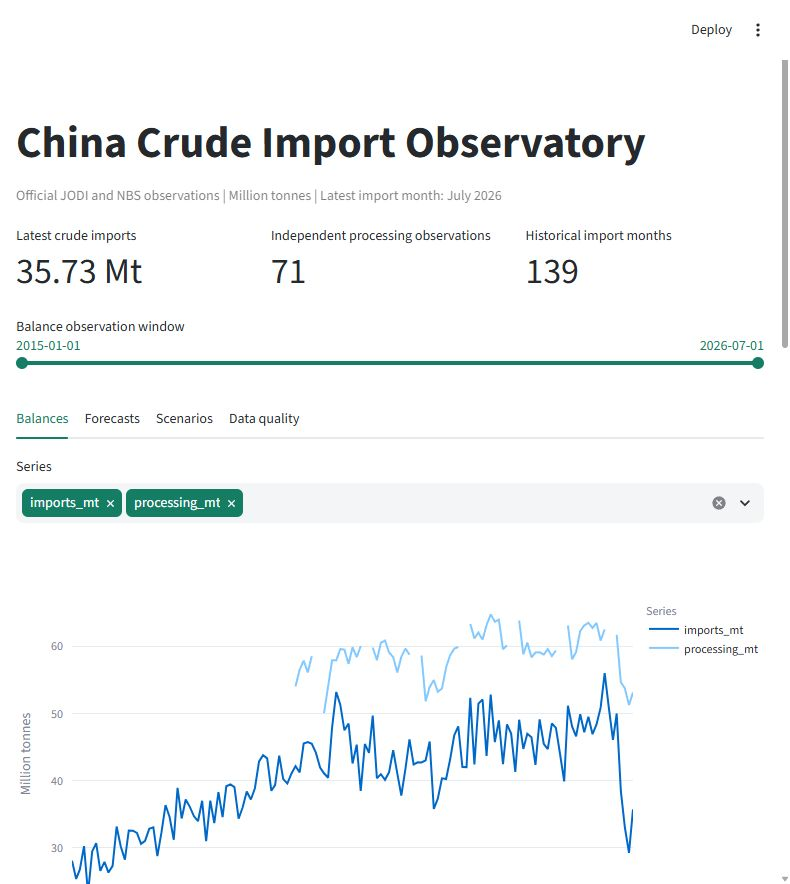

# China Crude Import Observatory

A reproducible research project asking whether refinery activity, domestic production and seasonality help forecast China's crude-oil imports. It combines official JODI data with independently surveyed refinery processing from China's National Bureau of Statistics (NBS).

## What is this project for?

Refineries turn crude oil into products such as petrol, diesel and jet fuel. China supplies those refineries with both domestically produced and imported crude. If refinery demand increases without an equivalent rise in domestic production, more imports may be needed, depending on inventories and other flows.

This project tests that idea using real observations. It is intended to demonstrate data sourcing, quantitative research and clear commercial communication for supply, trading and shipping roles. It provides context for demand planning; it does not establish profitable trading signals.

For example, if refineries process 60 million tonnes (Mt) and domestic production supplies 17 Mt, the remaining requirement is 43 Mt before accounting for stocks, exports and other flows. In the scenario tool, an extra 2 Mt of processing and an extra 1 Mt of production imply an extra 1 Mt of imports required, holding other assumptions constant. This is an accounting sensitivity, separate from a statistical forecast.

**New to oil markets or forecasting? Start with the [plain-English project guide](docs/PROJECT_EXPLAINED.md).** It explains the question, data choices, results and interview talking points without assuming technical knowledge.

## What was built?

- A pipeline retaining official data snapshots, source links, retrieval timestamps and checksums.
- 139 monthly import observations from January 2015 through July 2026, and 72 numeric independent NBS processing observations, 71 aligned with the import window.
- Chronological evaluations of one-, two- and three-month forecasts against seasonal, persistence and imports-only benchmarks.
- A local dashboard with balances, forecast comparisons, accounting scenarios, data-quality flags and CSV downloads.
- A [research memo](outputs/research_memo.md), [Excel workbook](outputs/research_tables.xlsx) and [data-quality audit](outputs/data_quality.md).



## What did the research find?

Under the two-month publication-lag assumption, the full ridge model produced the following mean absolute errors. Mt means million tonnes; lower error is better.

| Forecast horizon | Full model MAE (Mt) | Seasonal benchmark MAE (Mt) | Test observations |
|---|---:|---:|---:|
| One month | 4.34 | 4.62 | 29 |
| Two months | 4.71 | 4.55 | 27 |
| Three months | 4.33 | 4.73 | 25 |

**The findings are mixed.** The model improves average absolute error at one and three months under this assumption, but loses at two months. Improvements are not consistent across error measures or publication-lag assumptions. Nominal 90% uncertainty bands were poorly calibrated in the small evaluation sample. See the [complete metrics](outputs/metrics.csv) before interpreting the headline results.

An important data finding: JODI's China refinery intake is partly calculated from imports. Using it to predict imports would create a circular relationship. The model instead uses independently surveyed NBS processing. Missing inventory observations remain missing, and combined January-February activity is not treated as separate independent monthly measurements.

## Explore the project

Read the [plain-English guide](docs/PROJECT_EXPLAINED.md) for the story, the [memo](outputs/research_memo.md) for commercial interpretation, or the [Excel tables](outputs/research_tables.xlsx) to inspect the evidence. Technical scope is in [PRD.md](PRD.md), and development/data-integrity instructions are in [AGENTS.md](AGENTS.md).

The screenshot is a preview. The interactive dashboard runs on your own computer using the instructions below; it is not hosted at a public web address.

## Run on Windows

```powershell
python -m venv .venv
.\.venv\Scripts\python.exe -m pip install -r requirements.txt
.\.venv\Scripts\python.exe scripts\ingest.py
.\.venv\Scripts\python.exe scripts\nbs_ingest.py
.\.venv\Scripts\python.exe scripts\evaluate.py
.\.venv\Scripts\python.exe scripts\report.py
.\.venv\Scripts\python.exe -m unittest discover -s tests
.\.venv\Scripts\python.exe -m streamlit run app.py --server.port 8501
```

Dashboard: http://localhost:8501 . It runs locally; no credentials or paid data are required. Official downloads need internet access. Existing immutable snapshots make analytical evaluation reproducible without downloading again. Preserve raw files when reproducing results; refresh in a new snapshot directory for revision analysis.

For a fast rebuild of the verified NBS dataset, run `scripts\nbs_ingest.py --max-pages 0`. Many direct NBS archive requests return access-challenge pages; the pipeline audits these and merges checked-in, verified transcriptions from readable official publications. These are actual source observations with provenance, not generated data. Automated discovery cannot presently recover every historical release directly.

The continuous independent processing window begins August 2019. January-February is unavailable as separate observed months. An isolated December 2015 release is retained for audit but excluded from the model window. JODI covers 139 import months through July 2026; NBS extends through August 2026, with 72 numeric source observations and 71 aligned to the JODI window.

The initial findings are mixed: the model improves MAE at some horizons but does not consistently outperform across publication-lag assumptions or error measures. Nominal 90% error-band coverage is poor on a small sample. See the memo and metrics rather than treating the forecasts as calibrated trading signals.

## Inputs and outputs

- `data/raw`: official snapshots, source links, checksums and retrieval timestamps.
- `data/processed/jodi_observations.csv`: original JODI units, values and assessment codes plus normalized million tonnes.
- `data/processed/nbs_processing.csv`: independent surveyed processing with publication dates and aggregation flags.
- `outputs/jodi_coverage.csv`: full annual coverage audit.
- `outputs/predictions.csv`, `metrics.csv`: actual expanding-window evaluation at horizons 1, 2 and 3 months.
- `outputs/research_memo.md`: findings, two observed historical cases and commercial interpretation.
- `outputs/research_tables.xlsx`: inspectable observations, evaluation and metrics.

## Research safeguards

JODI China refinery intake is calculated from supply flows, including imports; it is excluded from model features. NBS coverage is enterprises above its reporting threshold and changes over time. Missing stocks stay missing. Supply minus processing is an indicative residual, not inventory.

January-February JODI activity is calendar-disaggregated. Those forecast target months are excluded, and combined NBS processing is not used as independently measured monthly activity. Comparisons share the same valid target months. Features use a minimum two-month lag; a three-month lag is a sensitivity. Model training includes only targets observable by that origin under the same lag. Scaling is fitted inside each expanding training window. Ridge regularization is fixed at alpha 10 without test-set tuning.

Historical data vintages are unavailable: evaluation uses revised snapshots and cannot be claimed as a fully point-in-time backtest. Forecast origin is the first day of the month; horizons refer to subsequent calendar months. Empirical 90% bands use prior observable errors only and require 20 prior errors. Negative model performance is a valid research finding.
